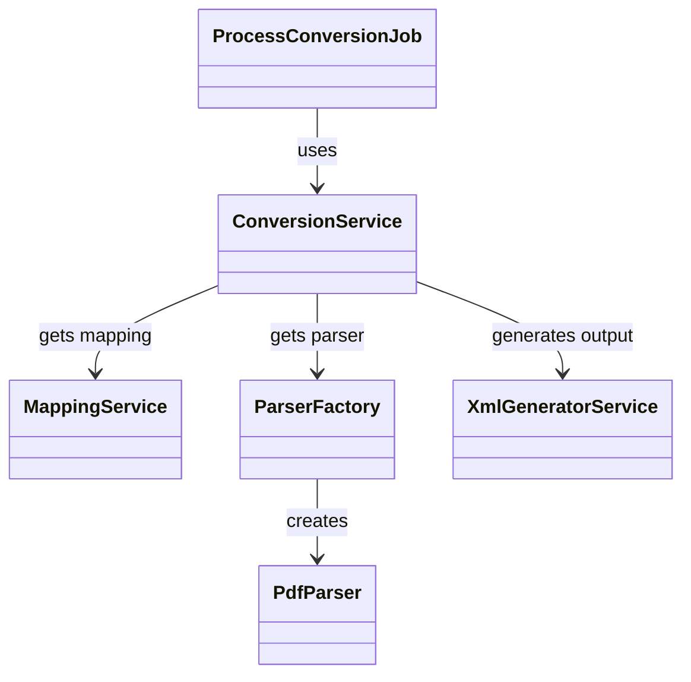

# Architectural Blueprint - Conversor de Planilhas

## Design Strategy
**Service-Oriented Architecture (SOA) & Adapter Pattern**
O sistema utiliza um padrão de serviços para delegar responsabilidades de conversão, mapeamento e geração de XML.

## Patterns Applied
1. **Adapter Pattern**: Utilizado no `ParserFactory` para suportar múltiplos formatos de arquivo (Excel, CSV, PDF) sob uma interface comum.
2. **Strategy Pattern**: Aplicado no `MappingService` para gerenciar diferentes regras de mapeamento de colunas.
3. **Facade Pattern**: O `ConversionService` atua como uma fachada para a lógica complexa de transformação de dados.

## UML Structure

## Anti-Pattern Warning
**Long-Running Job**: Evite jobs síncronos longos. Se a conversão durar mais que 6 segundos, considere o uso de chunks ou filas distribuídas para garantir escalabilidade.
